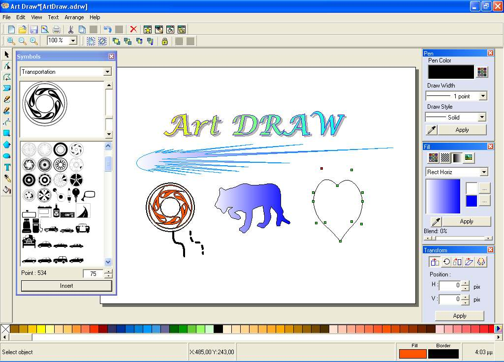



## ArtDraw \- Vector Graphics Software v1\.0\.1 \[28/3/2008\]

### Description

ArtDraw is Vector Graphics Software (like to CorelDraw)

Draw object -&gt;Polyline,Freepolygon,Free line (open or closed),

Curve(with bezier),RectAngle,Polygon,Ellipse,Text

Edit object-&gt; Color line,width and style line, Color backround, Fill with pattern,

image and (12) different Gradient.

Move, rotate, scale, skew , mirror any object

You can also zoom-it, open-save to file, copy-paste,undo-redo,

export to bmp,gif,jpg,png. Import not support yet.

Insert and edit symbols from fonts.

With the left click mouse, edit or view property for any object.

----

BUG FIX [28/3/2008]

FreePolyline,Polygon,Ellipse,Polyline for copy,cut,

paste and "Make Curve" with left mouse click.

----

 
### More Info
 

             |
---                |---
**Submitted On**   |2008-03-26 14:55:50
**By**             |[Diomidisk](https://github.com/Planet-Source-Code/PSCIndex/blob/master/ByAuthor/diomidisk.md)
**Level**          |Advanced
**User Rating**    |3.7 (11 globes from 3 users)
**Compatibility**  |VB 6\.0
**Category**       |[Graphics](https://github.com/Planet-Source-Code/PSCIndex/blob/master/ByCategory/graphics__1-46.md)
**World**          |[Visual Basic](https://github.com/Planet-Source-Code/PSCIndex/blob/master/ByWorld/visual-basic.md)
**Archive File**   |[ArtDraw\_\-\_2107743282008\.zip](https://github.com/Planet-Source-Code/diomidisk-artdraw-vector-graphics-software-v1-0-1-28-3-2008__1-70344/archive/master.zip)

